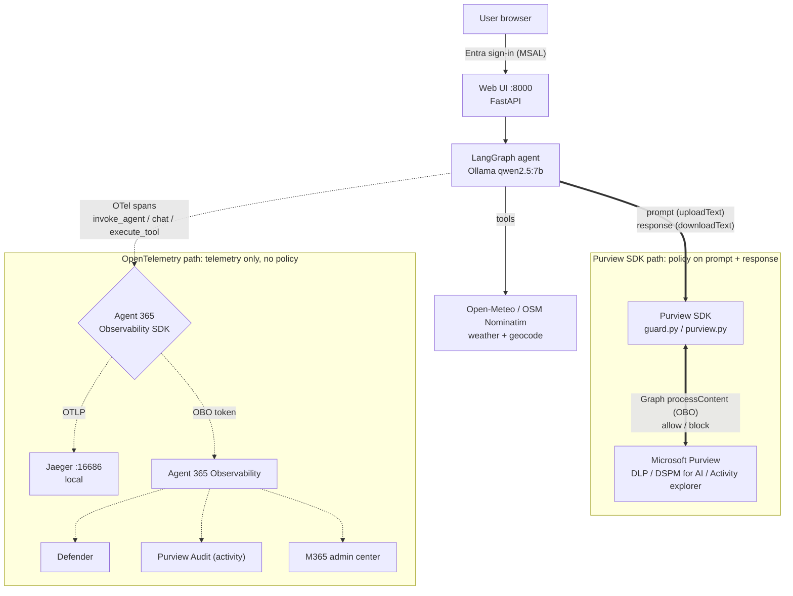

# Agent 365 – Third‑Party Agent Registry Demo

A tiny **third‑party** agent (Python + LangGraph + a local Ollama model) that answers
*"What's the weather in San Francisco?"* or *"Geocode 1 Microsoft Way, Redmond"*, and that you
register in **Microsoft Agent 365**. It's built with two Microsoft SDKs:

- the **Agent 365 Observability SDK** (OpenTelemetry), which sends activity telemetry to **Microsoft Defender**,
  **Purview Audit** and the **Microsoft 365 admin center**;
- the **Purview SDK** (Microsoft Graph Purview APIs), which sends each **prompt and response** to **Microsoft Purview**
  for policy evaluation (DLP, DSPM for AI) before the LLM runs and before the answer is shown.

It runs entirely on a laptop or VM: no Docker, no Azure hosting, no paid model.



> **Two separate channels.** Prompts and responses go from LangGraph to Purview **through the Purview SDK**
> (`processContent`). That's where DLP allows or blocks them. OpenTelemetry carries activity telemetry; it does
> **not** evaluate or enforce prompt/response policies.

| Component | Choice | Why |
|---|---|---|
| Agent framework | LangGraph `create_react_agent` | Genuinely third‑party (not Foundry / Copilot Studio) |
| Model | Ollama `qwen2.5:7b` (default) or GitHub Models | Free, local, works offline |
| Tools | Open‑Meteo (weather, city geocode) + OSM Nominatim (address geocode) | Free, no API keys |
| Identity | Entra Agent ID **blueprint → agent identity**, OBO | The Agent 365 pattern for user‑driven agents |
| Telemetry | Agent 365 Observability SDK (`microsoft-opentelemetry`) → Agent 365 exporter **and** local Jaeger | Show the same trace locally and in Microsoft 365 |
| Data security | **Purview SDK**: Graph `protectionScopes/compute`, `processContent`, `contentActivities` (`agent/purview.py`) | Prompt/response text reaches Purview; DLP can block per policy |

## Quick start

```powershell
.\scripts\setup.ps1     # Python 3.12 venv, Ollama + model, Jaeger, .env
.\scripts\run.ps1       # Jaeger :16686 + agent UI :8000
.\scripts\run.ps1 -EnvFile .env.agent2   # optional 2nd agent identity (same blueprint) on :8001
```

Open <http://localhost:8000> and ask *"What's the weather in San Francisco?"*. With `AUTH_ENABLED=false` (the default) there is no sign‑in and traces go only to Jaeger.

> Once registered, `A365_VERBOSE=true` in `.env` makes `run.ps1` print `Exporting N spans to endpoint: …`
> for each attempted batch. This line precedes the HTTP request and does not prove delivery.
> Check the subsequent HTTP response and its body; even HTTP success does not prove Purview
> has processed and made the prompt content viewable. Set it to `false` for a quieter demo console.

## Documentation

**Start here for a new tenant:** [Admin lab and validation checklist](docs/admin-validation.md).
It lists required access, deployment impact, the evidence for each stage and cleanup limitations.

| Doc | Content |
|---|---|
| [docs/00-diagrams.html](docs/00-diagrams.html) | **All diagrams in one page** (high-level Agent 365 integration points, solution architecture, setup steps, identities, OBO sign-in, chat turn, telemetry routing, DLP, CA) for presenting |
| [docs/Agent365-Demo-Diagrams-clean.pptx](docs/Agent365-Demo-Diagrams-clean.pptx) | Publication copy with generic agent names and author metadata, light background and talk track in speaker notes. Rebuild after editing `00-diagrams.html` with `docs\deck\Build-Deck.ps1` (add `-Render` for PNG previews); the operator-specific original is kept locally and ignored |
| [docs/01-run-agent.md](docs/01-run-agent.md) | Install, run and smoke‑test the agent locally (no tenant needed) |
| [docs/02-register.md](docs/02-register.md) | Register the agent in Entra ID / Agent 365 with the `a365` CLI, including the Purview SDK permissions, with a portal checkpoint after each step |
| [docs/03-observability.md](docs/03-observability.md) | OpenTelemetry: Jaeger → Defender advanced hunting → Purview → M365 admin center, plus troubleshooting |
| [docs/05-phase2-dlp-ca.md](docs/05-phase2-dlp-ca.md) | Purview SDK + DLP (San Francisco allowed, Dallas blocked), and the Conditional Access design |
| [docs/presenter-script.md](docs/presenter-script.md) | Customer walkthrough talk track with timing cues |
| [docs/04-reset.md](docs/04-reset.md) | Reset between demos, and full tenant cleanup |
| [docs/admin-validation.md](docs/admin-validation.md) | Clean-tenant admin lab, validation evidence, privacy/publishing checks and cleanup limitations |

**Purview SDK (built in):** the Purview SDK is part of the agent and of the registration process.
`Configure-Entra.ps1` makes the Graph Purview scopes (`ProtectionScopes.Compute.User`, `Content.Process.User`,
`ContentActivity.Write`) inheritable permissions on the blueprint, and the agent calls `protectionScopes/compute` +
`processContent` on every prompt and response (as the agent identity, OBO the user). DSPM for AI sees the
prompt/response text and a DLP policy can block it (weather for San Francisco allowed, Dallas blocked). See
[docs/05-phase2-dlp-ca.md](docs/05-phase2-dlp-ca.md).

**Phase 2 (not built yet):** **Conditional Access** (Alice on a compliant device or corporate network allowed; Bob blocked).

## Repo layout

```
agent/
  app.py              FastAPI web app + per-turn InvokeAgentScope
  graph.py            LangGraph ReAct agent (Ollama or GitHub Models)
  tools.py            get_weather / geocode tools
  telemetry.py        microsoft-opentelemetry distro + Jaeger exporter + token resolver
  a365_callbacks.py   LangChain callback -> InferenceScope / ExecuteToolScope spans
  auth.py             MSAL sign-in + blueprint -> agent identity OBO (exporter token, Purview Graph token)
  guard.py            prompt_guard() / response_guard() -> Purview policy enforcement
  purview.py          Graph Purview APIs: protectionScopes/compute, processContent, contentActivities
  diagnostics.py      /api/diagnostics: token claims, agent identity, grants, CA + Purview policies
  smoke.py            one-turn smoke test (no browser)
  verify_spans.py     prove spans pass the Agent 365 exporter filters, offline
web/index.html        chat UI + Diagnostics tab
scripts/
  setup.ps1           bootstrap (idempotent)
  run.ps1             start Jaeger + Ollama + app (-EnvFile .env.agent2 = 2nd instance)
  Configure-Entra.ps1 post-registration wiring (scope, web client app, consent, .env)
                      -UseAzCli reuses the `az login` session (no interactive prompt)
                      -IdsOnly writes just the real IDs, no admin sign-in
  New-AgentInstance.ps1
                      add another agent identity to the blueprint: identity, redirect URI,
                      registry record (agent_registry.py), .env.agent<N> overlay
  Sync-AgentPermissions.ps1
                      mirror the blueprint's grants + app roles onto every agent identity
                      (so Entra admin center > Permissions matches the blueprint)
  New-PurviewDlpDemo.ps1
                      DLP policy (Dallas blocked) for every agent instance
  Test-Readiness.ps1  read-only local configuration check (not proof of delivery)
  Grant-PurviewContentViewer.ps1
                      grant a user the Purview role needed to READ prompt/response
                      text in Activity explorer (Global Admin alone is not enough)
                      -CheckOnly reports current membership, changes nothing
  dev/
    Test-ConfigureEntra.ps1  offline harness: runs Configure-Entra.ps1 against a fake Graph
  reset.ps1           local reset; -Tenant for full cleanup
tests/                unit tests (offline; _fixture_env.py fakes blank IDs)
skills/agent365-third-party-agent/
                      Copilot skill to build the NEXT agent from this one (see below)
```

## Reuse: build a new agent with the skill

`skills/agent365-third-party-agent` packages this project as a sanitized template, plus every lesson learned
(registration, observability, Purview SDK and DLP, CA, diagnostics, troubleshooting). It's installed at
`~\.copilot\skills\agent365-third-party-agent`. Ask Copilot something like *"create a new Agent 365 agent that looks up stock prices"*, or scaffold directly:

```powershell
python $HOME\.copilot\skills\agent365-third-party-agent\scripts\new_agent.py `
  --dest D:\Repos\My-New-Agent --name Contoso-StockAgent --provider "Contoso ISV" `
  --description "Looks up stock quotes" --tenant-id <tenant-guid>
```

After changing this repo, refresh the template with
`python skills\agent365-third-party-agent\scripts\build_template.py D:\Repos\Local-Agent-Playground --extra-id <guid>=<name>`
and copy the skill folder back to `~\.copilot\skills`.

> **Security note:** this is a demo. Secrets live in `.env` (git‑ignored) and expire after 30 days.
> In production, use certificates or managed identity (FIC) instead of client secrets.

Before publishing, run `python .\scripts\Test-PublishReadiness.py` and review the staged files.
Local credentials/configs, tools, logs, Office lock files, render output and operator planning notes are ignored.
Do not upload the working folder as a ZIP: ignore rules apply to Git, not arbitrary uploads.
The three-agent comparison and Conditional Access steps are documented plans; they are not provisioned by setup.
