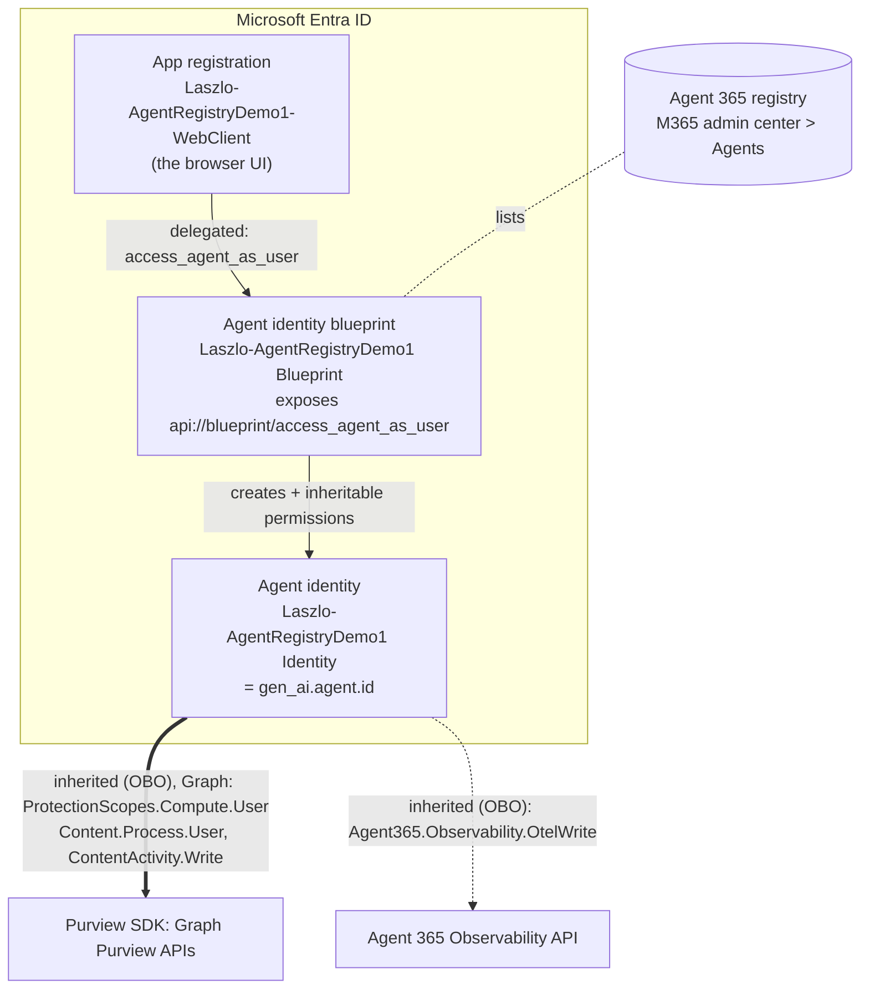
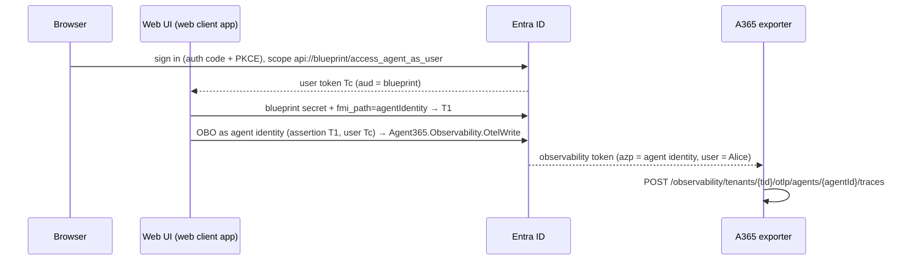

# 02 – Register the agent in Entra ID and Agent 365

> 📊 Diagrams for this walkthrough: [00-diagrams.html](00-diagrams.html) (open in a browser)

Goal: turn the local agent into a **governed, registered agent**. It gets an Entra Agent ID
(blueprint → agent identity), appears in the Agent 365 registry, users sign in to it with Entra ID, and it's
enabled for both Microsoft SDKs it's built with:

- **Agent 365 Observability SDK** (OpenTelemetry): needs `Agent365.Observability.OtelWrite`.
- **Purview SDK** (Graph Purview APIs, `agent/purview.py`): needs Graph `ProtectionScopes.Compute.User`,
  `Content.Process.User` and `ContentActivity.Write`. This is how prompts and responses reach Purview for DLP;
  OpenTelemetry doesn't evaluate prompt/response policies.

Both sets of scopes are configured **during registration** (step 4) as inheritable permissions on the blueprint,
so every agent identity created from it gets them.



**Why three objects?** A blueprint is the *template and credential holder*, and it carries the inheritable
permissions. The agent identity is the *runtime principal*, and it's what Defender, Purview and the registry show.
Blueprints and agent identities can't run an interactive `/authorize` sign‑in, so a normal app registration (the web
client) signs the user in and requests a token for the blueprint. The agent then exchanges that token
(OBO) for two tokens as the agent identity: a Graph token for the Purview SDK and an observability token for the exporter.

## 0. Prerequisites (check before the customer call)

| Requirement | How to check |
|---|---|
| Global Administrator in the demo tenant (or Agent ID Developer + GA for consent) | Entra admin center → Roles |
| Agent 365 enabled | M365 admin center → **Agents** is visible |
| **E7 or Agent 365 license *assigned* to at least one user** (otherwise telemetry is dropped silently) | M365 admin center → Billing → Licenses |
| Azure CLI | `az version` |
| .NET 8+ SDK and the Agent 365 CLI | `dotnet tool install --global Microsoft.Agents.A365.DevTools.Cli` then `a365 --version` |
| Graph PowerShell | `Install-Module Microsoft.Graph.Authentication -Scope CurrentUser` |
| The agent runs locally | [01-run-agent.md](01-run-agent.md) |

> Run every command below **from the repo root**. The CLI writes `a365.generated.config.json` to the
> current directory, and `Configure-Entra.ps1` reads it from there.

## 1. Sign in to the tenant

```powershell
az login --tenant <tenant-id-or-domain> --allow-no-subscriptions
az account show --query "{tenant:tenantId, user:user.name}" -o table
```

> **"No subscriptions found for …"** means the tenant has no Azure subscription. That's normal for an
> M365 demo tenant and has nothing to do with the E7 license or the Global Admin role.
> `--allow-no-subscriptions` signs in at tenant level, which is all this localhost‑only demo needs.
> If `a365 setup requirements` reports **Azure** checks as failed, you can ignore them; the Azure subscription
> is only needed for hosting (App Service), which this demo skips. Pass `--tenant-id <guid>` to the
> `a365` commands if tenant auto‑detection fails.

*Talk track:* "The Agent 365 CLI uses your Azure CLI sign‑in. Nothing is installed in Azure for this
agent; it stays on this laptop. We only create identities in Entra."

## 2. Validate prerequisites

For a fresh clone, initialize the CLI project configuration first:

```powershell
a365 config init
```

Use your test tenant and a local/existing-agent configuration; do not select Azure hosting for this lab.
This creates the ignored `a365.config.json`, which later scripts read for `tenantId` and `clientAppId`.
Review the generated configuration before continuing. Never copy the original operator's config or secrets
into a new tenant.

```powershell
a365 setup requirements
```

This checks roles, the Agent 365 CLI client app (the Microsoft‑managed **Agent 365 CLI** enterprise
app, with a tenant‑owned fallback), and tenant readiness. Fix anything reported as red before you continue.

## 3. Dry run, then register

```powershell
a365 setup all --agent-name Laszlo-AgentRegistryDemo1 --authmode obo --dry-run
```

Read the plan aloud with the customer. Expected output (CLI 1.1.x, no Azure subscription):

```
1. Prerequisites            validate (Azure CLI, PowerShell modules)
2. Blueprint                create (multi-tenant): Laszlo-AgentRegistryDemo1 Blueprint
                              create service principal
                              create client secret
                              create federated identity credential (FIC)
                              create managed identity
3. Inheritable Permissions  skipped (permissions set directly on agent identity)
4. Agent identity           create: Laszlo-AgentRegistryDemo1 Identity
5. Permission Grants        delegated grants - attempted programmatically for the signed-in principal
6. Agent Registration       register: Laszlo-AgentRegistryDemo1 Agent
7. Messaging endpoint       skipped (non-M365 agent)
8. Project settings         write to appsettings.json
```

What each line means for this demo:

| Step | Note |
|---|---|
| 2 FIC / managed identity | Only used when the agent is hosted in Azure. With no App Service, the CLI logs *"Skipping Federated Identity Credential creation (no MSI Principal ID provided)"*. That's expected. |
| 2 client secret | Stored in `a365.generated.config.json`, DPAPI‑protected on Windows. The CLI also writes the plaintext value into `.env` as `CONNECTIONS__SERVICE_CONNECTION__SETTINGS__CLIENTSECRET`, which `Configure-Entra.ps1` reuses; it only mints its own `local-demo` secret if neither is usable. |
| 3 inheritable skipped | With `--authmode obo` the CLI puts permissions directly on the agent identity. `Configure-Entra.ps1` (step 4) then configures blueprint inheritance so agent identities inherit the Purview SDK, observability and Power Platform scopes. |
| 5 grants for the signed‑in principal | Covers only you. `Configure-Entra.ps1` adds tenant‑wide consent so Alice and Bob work too. |
| 7 endpoint skipped | Correct: this is a standard (non‑Teams) agent on localhost. |
| 8 appsettings.json | Written for .NET projects; this Python app ignores it (it's git‑ignored). The CLI also appends a block of `CONNECTIONS__*` / `AGENT365OBSERVABILITY__*` variables to `.env`. Leave them: they're harmless, and `Configure-Entra.ps1` reads the blueprint secret out of them. |

> If the dry run plans an Azure App Service, stop. This demo is localhost‑only.
> Use the granular path instead: `a365 setup blueprint -n Laszlo-AgentRegistryDemo1 --no-endpoint`,
> then `a365 setup all -n Laszlo-AgentRegistryDemo1 --authmode obo --agent-registration-only`.

Run it for real:

```powershell
a365 setup all --agent-name Laszlo-AgentRegistryDemo1 --authmode obo
```

A Windows sign‑in (WAM) dialog may appear for consent. Sign in as the GA.

`--authmode obo` means the agent acts **on behalf of the signed‑in user**, so each trace is attributed
to a real person. That's what makes Purview audit and Conditional Access (Phase 2) meaningful.

### ✅ Checkpoint A: Entra admin center

<https://entra.microsoft.com> → **Agent ID** (Entra ID → Agents):

- **Agent blueprints** → `Laszlo-AgentRegistryDemo1 Blueprint`. Show the owner or sponsor, and the credentials tab.
- **All agent identities** → `Laszlo-AgentRegistryDemo1 Identity`. Note its **App ID**; this is the value
  you'll see as `AgentId` in Defender later.

### ✅ Checkpoint B: Agent 365 registry

<https://admin.cloud.microsoft> → **Agents** → **All agents**: `Laszlo-AgentRegistryDemo1` is listed.
Open it and show the publisher, the identity, and the fact that admins can block it here without touching the code.

### Verify CLI setup and registry (read-only)

`a365.generated.config.json` can show `"completed": false` even after a successful blueprint-only
(`--authmode obo`) run. Don't rely on that flag. Check these instead:

```powershell
a365 setup requirements                  # prerequisites
a365 setup all --dry-run                 # every phase should say "reuse" or "skipped", never "create"
a365 query-entra instance-scopes         # agent identity -> maven-prod: Agent365.Observability.OtelWrite
Select-String "$env:LOCALAPPDATA\Microsoft.Agents.A365.DevTools.Cli\logs\a365.setup.log" -Pattern 'Setup Summary' -Context 0,9
```

`query-entra blueprint-scopes` lists the blueprint's **inheritable permissions** after
`Configure-Entra.ps1` runs (step 4): Microsoft Graph `Content.Process.User`, `ContentActivity.Write`,
`ProtectionScopes.Compute.User` (Purview SDK), `maven-prod` `Agent365.Observability.OtelWrite`, and
Power Platform API `Connectivity.Connections.Read`. Straight after `a365 setup all --authmode obo` it
shows none: OBO setup puts its own grants directly on the agent identity. Messaging endpoint is
**skipped**, which is expected for a non-M365 agent.

To read the registry record itself, sign in with the CLI client app. It already has consent for
`AgentRegistration.ReadWrite.All`:

```powershell
$gen = Get-Content .\a365.generated.config.json -Raw | ConvertFrom-Json
$cfg = Get-Content .\a365.config.json -Raw | ConvertFrom-Json
Connect-MgGraph -TenantId $cfg.tenantId -ClientId $cfg.clientAppId -Scopes AgentRegistration.ReadWrite.All -NoWelcome
Invoke-MgGraphRequest GET "https://graph.microsoft.com/beta/copilot/agentRegistrations/$($gen.agentRegistrationId)"
```

Expect `agentIdentityId` = agent identity app ID, `agentIdentityBlueprintId` = blueprint ID, and
`managedByAppId` = the **Agent 365** first-party app. The legacy `/beta/agentRegistry/agentInstances`
API returns 404 after the move to the Agent 365 registry, so use the endpoint above.

## 4. Wire up sign‑in, the observability token and the Purview SDK permissions

```powershell
.\scripts\Configure-Entra.ps1 -UseAzCli -WhatIf   # preview
.\scripts\Configure-Entra.ps1 -UseAzCli
.\scripts\Test-Readiness.ps1                      # check local configuration, not delivery
.\scripts\Test-Readiness.ps1 -Tenant              # + read-only tenant check (Purview SDK scopes, OtelWrite)
```

`-UseAzCli` reuses the `az login` session from step 1 instead of opening a second interactive
`Connect-MgGraph` prompt. It's the recommended path: the Azure CLI token already carries
`Application.ReadWrite.All` and `DelegatedPermissionGrant.ReadWrite.All`, which is everything the
script needs **provided `a365 setup all` already created the blueprint scope and secret** (it does).
Drop `-UseAzCli` to use `Connect-MgGraph` instead — that path also asks for
`AgentIdentityBlueprint.*`, so use it if the blueprint scope or secret is missing.

The script is idempotent: re-run it freely. It exits non-zero and prints a red box if the
`Agent365.Observability.OtelWrite` grant fails — that grant is what makes telemetry work, so don't
ignore it.

| Step | Entra change |
|---|---|
| Expose API | Reuses the `access_agent_as_user` scope that `a365 setup` exposes on `api://<blueprintAppId>` (creates it if missing) |
| Blueprint secret | Reuses the secret `a365 setup all` wrote to `.env`; only mints its own 30‑day `local-demo` secret if that's unusable |
| Web client | App registration `Laszlo-AgentRegistryDemo1-WebClient`, redirect `http://localhost:8000/auth/callback`, secret |
| Consent | Tenant‑wide consent: web client → blueprint `access_agent_as_user` + Graph `openid profile offline_access User.Read`; agent identity → `Agent365.Observability.OtelWrite` |
| Inheritable permissions | For each resource, runs `a365 setup permissions custom --resource-app-id <id> --scopes <scopes>`. That adds the scopes to the blueprint, grants tenant‑wide admin consent, and marks them **inheritable**, so every agent identity created from the blueprint shows them as *Inherited from parent*: Graph `Content.Process.User ContentActivity.Write ProtectionScopes.Compute.User` (Purview SDK), `Agent365.Observability.OtelWrite`, and Power Platform `Connectivity.Connections.Read` |
| Mirror grants | Runs `Sync-AgentPermissions.ps1` so the agent identity also holds the same tenant‑wide grants and app roles as the blueprint (see below) |
| `.env` | Fills in all IDs and secrets; sets `AUTH_ENABLED=true` and `ENABLE_A365_OBSERVABILITY_EXPORTER=true` |

A successful run ends with all three consent lines:

```text
==> Granting admin consent
    <blueprint-app-id> : access_agent_as_user
    00000003-…  : offline_access openid profile User.Read
    Agent identity -> Agent 365 Observability : Agent365.Observability.OtelWrite (all users)
==> Blueprint inheritable permissions
    00000003-0000-0000-c000-000000000000 : Content.Process.User ContentActivity.Write ProtectionScopes.Compute.User (inheritable, admin consented)
    9b975845-388f-4429-889e-eab1ef63949c : Agent365.Observability.OtelWrite (inheritable, admin consented)
    8578e004-a5c6-46e7-913e-12f58912df43 : Connectivity.Connections.Read (inheritable, admin consented)
```

If the third line is missing, telemetry will **not** reach Defender or Purview no matter how long you wait.

### Make the agent identity's Permissions blade match the blueprint

Inheritable permissions are resolved **at token time**. An agent identity can get Purview and OtelWrite tokens even
when Entra admin center → Enterprise applications → *agent* → **Permissions** lists nothing, because that blade only
shows explicit grants. On top of that, `a365 --authmode obo` creates `Principal` grants for the admin only. To make
what a customer sees match the blueprint, mirror the blueprint's tenant‑wide grants onto every agent identity:

```powershell
.\scripts\Sync-AgentPermissions.ps1 -WhatIf   # preview
.\scripts\Sync-AgentPermissions.ps1           # all agents in .env and .env.agent*
```

For every `AllPrincipals` grant on the blueprint principal, the script creates the same grant on each agent identity,
limited to the scopes the blueprint marks inheritable. It also copies the blueprint's inheritable app role
assignments, such as the observability `OtelWrite` role. It's idempotent and only uses the `az login` token, not the
a365 CLI. `Configure-Entra.ps1` and `New-AgentInstance.ps1` call it automatically.

```text
==> Laszlo-AgentRegistryDemo1 Identity (<agent-identity-app-id>)
    grant    Microsoft Graph: Content.Process.User ContentActivity.Write ProtectionScopes.Compute.User (all users)
    grant    maven-prod: Agent365.Observability.OtelWrite (all users)
    grant    Power Platform API: Connectivity.Connections.Read (all users)
    assign   role maven-prod: 8f71190c-00c8-461d-a63b-f74abde9ba52
```

`maven-prod` is the display name of the Agent 365 Observability API (`9b975845-…`).

> Run this **before** `run.ps1`. Straight after `a365 setup all` the `AGENT365_*` keys in `.env` are still
> empty and `AUTH_ENABLED` is `false`, so the app starts with `Agent 365 exporter enabled: False`,
> Jaeger spans carry the placeholders `local-dev-agent` / `local-dev-tenant`, and nothing reaches
> Defender or Purview.
>
> If you only want the **real IDs in local Jaeger** without admin sign-in or any tenant change:
>
> ```powershell
> .\scripts\Configure-Entra.ps1 -IdsOnly
> ```
>
> That copies the tenant, blueprint and agent identity IDs out of `a365.generated.config.json` into `.env`.
> Restart the app afterwards. The exporter stays off.

### ✅ Checkpoint C: app registrations

- **App registrations** → *All applications* → `…-WebClient` → **API permissions**: every permission
  shows *Granted for <tenant>*.
- Blueprint → **Expose an API**: `access_agent_as_user` is present.
- `.\scripts\Test-Readiness.ps1` reports local configuration prerequisites present; delivery is not verified.
- Restart `run.ps1`: startup must say `Agent 365 exporter enabled: True` with no warning banner.

## 4b. Fallback: do it by hand in the portal

Only needed if `Configure-Entra.ps1` fails and you can't wait to debug it. This produces exactly the
same result. Values in `< >` come from `a365.generated.config.json` (except `tenantId`, which is in
`a365.config.json`); `.\scripts\Test-Readiness.ps1` tells you which ones are still missing.

| Placeholder | Where to find it |
|---|---|
| `<tenantId>` | `a365.config.json` → `tenantId` |
| `<agentBlueprintId>` | `a365.generated.config.json` → `agentBlueprintId` |
| `<agenticAppId>` | `a365.generated.config.json` → `agenticAppId` (this is `gen_ai.agent.id`) |

<https://entra.microsoft.com>

**1. Confirm the blueprint scope** — *App registrations → All applications →
`<agent> Blueprint` → Expose an API*. You should already see `access_agent_as_user`
(created by `a365 setup all`). If the **Application ID URI** is blank, set it to
`api://<agentBlueprintId>`. If the scope is missing, **Add a scope**:

| Field | Value |
|---|---|
| Scope name | `access_agent_as_user` |
| Who can consent | Admins and users |
| Display name / description | Access the agent as the signed-in user |
| State | Enabled |

**2. Blueprint client secret** — same app → *Certificates & secrets → New client secret*, 30 days.
Copy the **Value** immediately. Skip this if `.env` already has
`CONNECTIONS__SERVICE_CONNECTION__SETTINGS__CLIENTSECRET` (the CLI wrote one).

**3. Web client app** — *App registrations → New registration*:

| Field | Value |
|---|---|
| Name | `<agent>-WebClient` |
| Supported account types | Accounts in this organizational directory only |
| Redirect URI | **Web** → `http://localhost:8000/auth/callback` |

Then on that new app:
- *Certificates & secrets → New client secret* (30 days). Copy the **Value**.
- *API permissions → Add a permission*:
  - **Microsoft Graph → Delegated**: `openid`, `profile`, `offline_access`, `User.Read`
  - **APIs my organization uses** → search `<agent> Blueprint` → **Delegated** → `access_agent_as_user`
- **Grant admin consent for \<tenant\>**, then confirm every row reads *Granted for \<tenant\>*.

**4. The grant that makes telemetry work** — *Enterprise applications → `<agent> Identity`
→ Permissions → **Grant admin consent***. It must list `Agent365.Observability.OtelWrite`.
Without this the exporter gets HTTP 403 and Defender, Purview and the admin center stay empty.

> `<agent> Identity` is the **agent identity**, not the blueprint. Remove the "Application type"
> filter if it doesn't appear in the list.

**5. Fill in `.env`** by hand:

```ini
AUTH_ENABLED=true
ENABLE_A365_OBSERVABILITY_EXPORTER=true
AGENT365_TENANT_ID=<tenantId>
AGENT365_BLUEPRINT_ID=<agentBlueprintId>
AGENT365_BLUEPRINT_CLIENT_SECRET=<secret from step 2>
AGENT365_AGENT_ID=<agenticAppId>
AGENT365_BLUEPRINT_SCOPE=api://<agentBlueprintId>/access_agent_as_user
WEB_CLIENT_ID=<Application (client) ID from step 3>
WEB_CLIENT_SECRET=<secret from step 3>
WEB_REDIRECT_URI=http://localhost:8000/auth/callback
```

Then `.\scripts\Test-Readiness.ps1` — it should report
local configuration prerequisites present. Confirm delivery separately using the exporter response and audit records.

## 5. Sign in and chat as a user

```powershell
.\scripts\run.ps1
```

Open <http://localhost:8000> → **Sign in** → sign in as a demo user (e.g. Alice) → ask for the San Francisco weather.
The header shows the user's name and an **Agent 365 export: ON** badge. Under the answer, *telemetry: token-ok* means the OBO chain worked and the exporter has a token.

What happens behind the scenes, per user:



### ✅ Checkpoint D: sign‑in logs

Entra admin center → **Monitoring & health → Sign‑in logs**:

- *User sign‑ins (interactive)*: Alice → `Laszlo-AgentRegistryDemo1-WebClient`
- *Agent sign‑ins* (or *Service principal sign‑ins*): `Laszlo-AgentRegistryDemo1 Identity` acting for Alice

This is where Conditional Access results will appear in Phase 2.

### ✅ Checkpoint E: Purview SDK

The Purview SDK is on by default once `AUTH_ENABLED=true` (`PURVIEW_ENABLED=true`, set by `Configure-Entra.ps1`).

- The header shows **Purview: ON**. Under each answer the meta line shows a `purview:` status, for example
  `purview: prompt:inline-allowed · response:inline-allowed` (a DLP policy evaluates inline),
  `prompt:offline-sent` (a policy applies but only audits), or `prompt:no-scope-activity-logged`
  (no policy scopes this user yet, so only a metadata-only `contentActivities` record is written).
- <http://localhost:8000/api/purview/scopes> (signed in) shows the user's protection scopes from
  `protectionScopes/compute`. `evaluateInline` means DLP can block.
- `purview: token-error: … AADSTS65001` means the inherited Graph Purview scopes aren't consented: re-run
  `Configure-Entra.ps1`, then `Test-Readiness.ps1 -Tenant`.

The DLP policy itself (San Francisco allowed, Dallas blocked) is set up in
[05-phase2-dlp-ca.md](05-phase2-dlp-ca.md).

## 6. Add a second agent instance to the same blueprint (optional)

One blueprint can have many agent identities, for example one per team or deployment. Each identity gets its own
registry record, its own `gen_ai.agent.id` in telemetry and its own Purview app location, while sharing the
blueprint's credentials and **inherited permissions** (observability `OtelWrite` and the Purview Graph scopes), so no
new consent is needed. The a365 CLI creates only the first identity, so `scripts\New-AgentInstance.ps1` does the rest.

```powershell
az login --tenant <tenant> --allow-no-subscriptions      # admin, if not already signed in
.\scripts\New-AgentInstance.ps1 -Name "Laszlo-AgentRegistryDemo2 Agent" -Port 8001
.\scripts\run.ps1 -EnvFile .env.agent2                   # agent 1 keeps running on :8000
```

| Step | What the script does |
|---|---|
| Agent identity | `POST /beta/serviceprincipals/Microsoft.Graph.AgentIdentity` with the **blueprint's own** client-credentials token (that's how Entra authorizes it), `agentIdentityBlueprintId`, you as sponsor and owner |
| Redirect URI | Adds `http://localhost:8001/auth/callback` to the shared web client app (the sign-in front end is shared, the agent identity behind it isn't) |
| Inheritance | Reads `.../agentIdentityBlueprint/inheritablePermissions`, then runs `Sync-AgentPermissions.ps1` to mirror the blueprint's grants onto the new identity so they show in the Entra admin center |
| Registry | `POST /beta/copilot/agentRegistrations` (via `scripts\agent_registry.py`, browser sign-in with `AgentRegistration.ReadWrite.All`). The record ID equals the agent identity ID |
| `.env.agent2` | Overlay loaded **before** `.env` (`AGENT_ENV_FILE`): port, redirect URI, agent ID and name, registration ID. Everything else is shared |

Every step is idempotent: re-running finds the existing identity, URI and record. Then:

- **Purview DLP:** re-run `.\scripts\New-PurviewDlpDemo.ps1` in a real console. It adds every `.env.agent*` instance
  as a policy location (`Set-DlpCompliancePolicy -Locations`), so Dallas is blocked for agent 2 too. Until the policy
  syncs, agent 2 shows `purview: prompt:no-scope-activity-logged` (audit only).
- **Checkpoints:** Entra → Agent ID → Agent identities shows both identities under the blueprint, with the
  permissions "Inherited from parent". M365 admin center → Agents shows both. On <http://localhost:8001>,
  🩺 Diagnostics shows the agent 2 ID as `azp`/`appid` in the observability and Purview tokens. Jaeger shows a
  second service name.
- Each port has its own session cookie (`session_<port>`), so you can be signed in to both instances at once.

## Troubleshooting

| Error | Cause / fix |
|---|---|
| `AADSTS65001` (consent required) | Re‑run `Configure-Entra.ps1`, or grant admin consent on the WebClient and agent identity |
| `AADSTS50013` / invalid assertion on OBO | `AGENT365_AGENT_ID` is not a child of `AGENT365_BLUEPRINT_ID`, or the blueprint secret is wrong |
| `AADSTS700016` (app not found) | The wrong tenant is in `.env`, or the CLI ran against a different `az` tenant |
| `AADSTS500011` (resource not found) for `api://…` | The expose‑API step didn't run: run `Configure-Entra.ps1` again |
| `AADSTS50011` (redirect URI mismatch) | `WEB_REDIRECT_URI` must be exactly `http://localhost:8000/auth/callback` |
| CLI can't find the "Agent 365 CLI" client app | See *Custom client app registration for Agent 365 CLI* on Microsoft Learn |
| `Agent 365 exporter enabled: False` at startup | `Configure-Entra.ps1` hasn't run yet (or didn't finish) — `.env` still has `ENABLE_A365_OBSERVABILITY_EXPORTER=false` and empty `AGENT365_*` values |
| `[Errno 10048] … only one usage of each socket address` | Another copy of the app is already on port 8000. Find it with `Get-NetTCPConnection -LocalPort 8000 -State Listen` and `Stop-Process -Id <OwningProcess>` |
| `Request_UnsupportedQuery` on `servicePrincipals?$filter=appId eq '<new>'` | Fixed — update to the current `Configure-Entra.ps1`, which no longer queries Graph for an app that `-WhatIf` didn't create |
| `Invalid URI: The hostname could not be parsed` on `POST /oauth2PermissionGrants` | Fixed — PowerShell variable names are case‑insensitive, so a local `$g` (grant) was shadowing the script's `$G` (Graph host) and wiping the base URL. Update to the current script, which uses `$GraphBase` |
| `Connect-MgGraph` window never appears / hangs | Use `-UseAzCli` instead; it reuses the `az login` session and never opens a prompt |

## Reference

- [Connect existing agents to Microsoft Agent 365](https://learn.microsoft.com/en-us/microsoft-agent-365/connect-existing-agents)
- [Quickstart: connect an existing agent](https://learn.microsoft.com/en-us/microsoft-agent-365/developer/get-started)
- [Agent 365 SDK and CLI](https://learn.microsoft.com/en-us/microsoft-agent-365/developer/)
- [Create an agent identity blueprint (expose scope, credentials)](https://learn.microsoft.com/en-us/entra/agent-id/identity-platform/create-blueprint)
