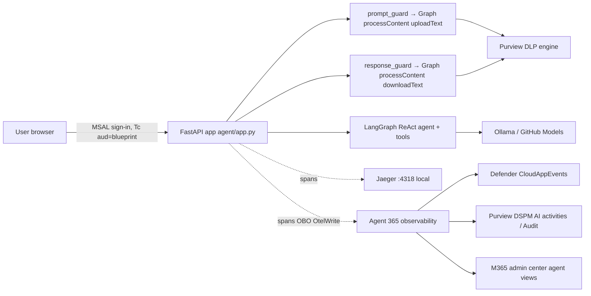

# Architecture and token flow

## Components

Two independent pipelines reach Purview, and customers often confuse them:

| Pipeline | Carries | Enforces policy? | Token |
|---|---|---|---|
| OpenTelemetry → Agent 365 exporter | spans (who, which tool, timing, messages for audit) | **No** | agent identity OBO, scope `9b975845-388f-4429-889e-eab1ef63949c/Agent365.Observability.OtelWrite` |
| Purview SDK (Graph `dataSecurityAndGovernance`) | the prompt and response text | **Yes** (inline block / offline) | agent identity OBO, Graph `Content.Process.User ContentActivity.Write ProtectionScopes.Compute.User` |

## Entra objects

| Object | Created by | Notes |
|---|---|---|
| Agent blueprint (app, `agentIdentityBlueprint`) | `a365 setup all` | appId usually equals objectId. Exposes `api://<bp>/access_agent_as_user`. Holds the client secret (demo) and the inheritable permissions |
| Blueprint SP | CLI | holds AllPrincipals grants for inheritable scopes |
| Agent identity (SP, `agentIdentity`, `ServiceIdentity`) | CLI | appId = SP id. **This is `gen_ai.agent.id`**. No agentic user for a third-party OBO agent (`agenticUserId: null` is expected) |
| Agent registration (`/beta/copilot/agentRegistrations/{id}`) | CLI | registry entry; managedByAppId = Agent 365 first-party app |
| `<Agent>-WebClient` app | `Configure-Entra.ps1` | Needed because blueprints and agent identities can't run `/authorize`. Redirect `http://localhost:8000/auth/callback`, secret, delegated `access_agent_as_user`, admin consent |

## Token chain (agent/auth.py)

1. **Tc**: the user signs into the web client and requests `api://<bp>/access_agent_as_user`, so `aud` = blueprint.
   Keep a per-session MSAL cache and refresh silently with `fresh_user_token`. `ReauthRequired` → HTTP 401 `session_expired`.
2. **T1**: blueprint client credentials to `/oauth2/v2.0/token` with `scope=api://AzureADTokenExchange/.default`
   and `fmi_path=<agentIdentityAppId>`. This is a raw httpx POST because MSAL Python has no `fmi_path`.
3. **OBO**: `grant_type=urn:ietf:params:oauth:grant-type:jwt-bearer`, `client_id=<agentId>`,
   `client_assertion_type=…jwt-bearer`, `client_assertion=T1`, `assertion=Tc`, `requested_token_use=on_behalf_of`, `scope=<target>`.
   The token is cached per `oid|scope`. The resulting token has `azp` = agent identity, and the user stays the subject.

Telemetry's `a365_contextual_token_resolver(agent_id, tenant_id)` returns the latest valid observability OBO token.
It returns `None` when the token is expired, so the exporter drops that chunk instead of retrying 401s forever. This works for a
single presenter only. Production code needs per-request tokens.

## Per-turn flow (`/api/chat`)

`BaggageBuilder(tenant, agent, conversation, session)` → `InvokeAgentScope` (root, `CallerDetails` = signed-in user,
`client.address`) → `prompt_guard` (blocked: record the block message as output and skip the LLM) → `run_agent` with the
`A365Callbacks` LangChain callback (an `InferenceScope` per LLM call and an `ExecuteToolScope` per tool call, each parented
explicitly) → `response_guard` → record output → response JSON `{text, tool_calls, blocked, purview}`.
